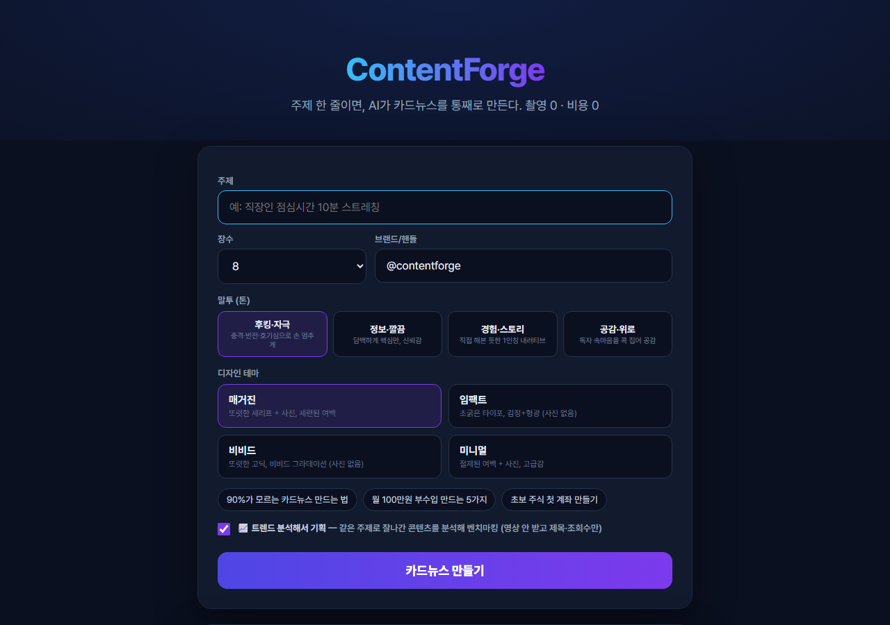
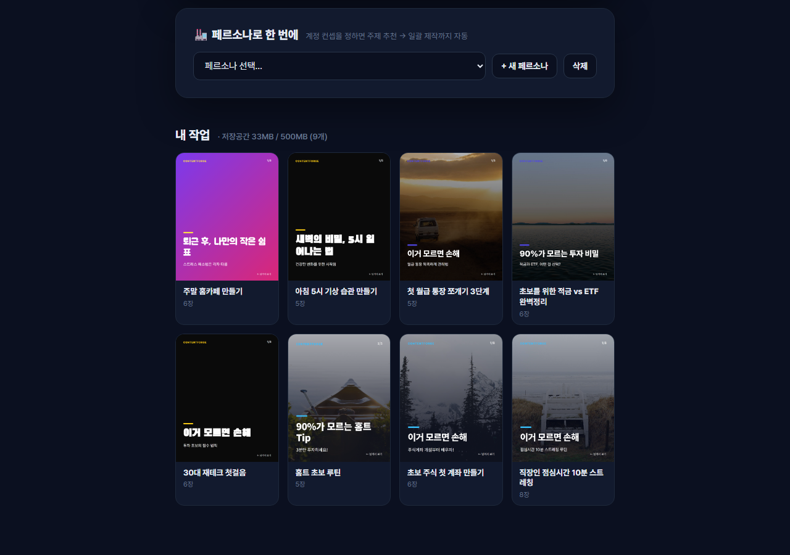
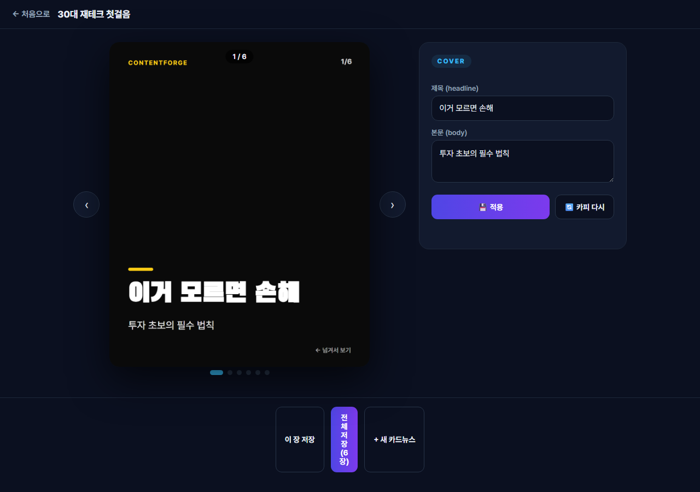
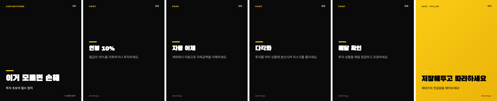

# ContentForge

주제 한 줄을 넣으면 **카드뉴스 한 세트**를 만들어 주는 로컬 앱.
기획(카피)부터 배경사진, 1080×1350 PNG 렌더까지 한 번에 굽고, 인스타식 리더기로 넘겨본다.

숏폼·카드뉴스 자동화를 파는 대행사들이 실제로 뭘 파는지 궁금해서, 결과물 쪽을 직접 만들어봤다.
카피는 로컬 LLM(Ollama)이 쓰고, 렌더는 헤드리스 Chrome이 HTML을 찍는다. 외부 API 없이 돈 안 들고 돈다.

## 화면

주제·장수·톤·테마를 고르고 누르면 카드가 한 장씩 구워지며 미리보기에 쌓인다.



만든 것들은 "내 작업"에 모인다.



리더기에서 넘겨보고, 카드별로 카피 수정 · AI 재생성 · 사진 교체를 할 수 있다.



실제 산출물 한 세트 (`30대 재테크 첫걸음`, 6장):



## 어떻게 도나

```
주제 ──▶ generate.py ──▶ images.py ──▶ render.py ──▶ out/<슬러그>/card_NN.png
        슬라이드 JSON      배경사진        HTML → Chrome 헤드리스 스크린샷
```

- **`generate.py`** — 후킹 프롬프트로 슬라이드 JSON을 뽑는다. 슬라이드마다 영문 `image_query`를 같이 내서 다음 단계가 사진을 찾을 수 있게 한다.
- **`images.py`** — `PEXELS_API_KEY`가 있으면 실사 검색, 없으면 picsum으로 떨어진다. 무사진 테마면 아예 건너뛴다.
- **`render.py`** — 슬라이드를 카드 HTML로 만들고 Chrome 헤드리스로 PNG를 찍는다. 테마는 CSS 변수로 주입한다.
- **`quality.py`** — 사람이 보기 전에 규칙으로 먼저 거른다(글자수·빈칸·클리셰·중복 헤드라인). 걸린 슬라이드만 다시 생성한다.
- **`app.py`** — 표준 라이브러리 `ThreadingHTTPServer`. 생성은 백그라운드 워커가 돌리고 진행률을 폴링한다.

## 만들면서 정한 것

- **카피가 반복되는 걸 규칙으로 잡았다.** 로컬 모델이 표지를 자꾸 "이거 모르면 손해"로 냈다.
  금지어 목록(`tones.DEFAULT_AVOID`)과 톤 프리셋 4종을 두고, 배치 생성 때는 이미 쓴 표지를
  누적해서 서로 겹치지 않게 했다.
- **검수를 사람에게 미루지 않았다.** 형식 위반은 `quality.check_cards`가 잡고
  `_self_fix`가 그 슬라이드만 다시 만든다. 다만 규칙은 형식만 본다 —
  후킹이 약한지, 내용이 헛소리인지는 아직 못 거른다.
- **페르소나를 만들었다.** 계정 컨셉(니치·타겟·톤·브랜드·테마)을 저장해두고
  주제 추천 → 여러 편 일괄 생성까지 간다. 대행사의 '운영대행'이 하는 일이 이 모양이라고 봤다.
- **용량에 상한을 뒀다.** `out/`이 500MB를 넘으면 오래된 것부터 지운다.

## 실행

```powershell
$env:PYTHONUTF8=1; python app.py     # http://127.0.0.1:8770
python run.py "직장인 점심시간 10분 스트레칭"   # CLI만
```

- Ollama가 떠 있어야 한다(`ollama serve`). 모델은 `qwen2.5:14b` > `gemma3` 순으로 자동 선택.
- 카드 PNG를 구우려면 Chrome이 필요하다(없으면 Edge).

## 아직 안 된 것

- 배경사진이 `PEXELS_API_KEY` 없이는 주제와 무관한 랜덤 이미지다
- 내용 품질을 LLM이 채점하는 층이 없다. 지금 게이트는 글자수 같은 형식만 본다
- 영상(숏폼)은 붙지 않았다

작업 기록과 이미 밟은 함정은 [`HANDOFF.md`](HANDOFF.md)에 있다.
